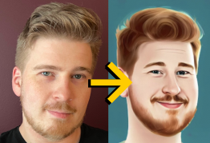

# Stable Diffusion cloud training tutorial
> Train Stable Diffusion (textual inversion) with your own images

This repository contains tutorials to train your own Stable Diffusion `.ckpt`
model using Google Cloud Platform (GCP) and Amazon Web Services (AWS).

## Getting started

For platform specific instructions, see the following:

* [Google Cloud Platform (GCP)](GCP.md)
* [Amazon Web Services (AWS)](AWS.md)

### On limits

Note that both AWS and GCP have limits on the number of GPU instances you can
run if you have a new account. You'll need to follow their instructions to
request a limit increase.

On my own testing it took 2 minutes for GCP to increase my limit from 0 to 1,
while it took 7 days to do the smae for AWS

## Licensing

This project is licensed under MIT license.
